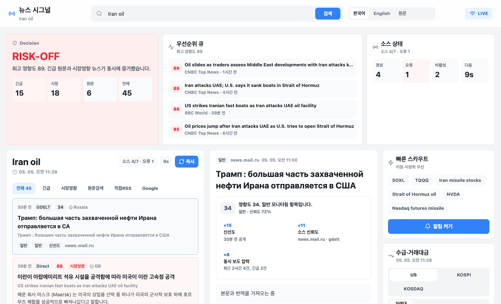

# News Signal Monitor

검색한 종목, ETF, 지정학 키워드에 대해 국내외 뉴스와 공시성 이슈를 실시간에 가깝게 모니터링하는 로컬 웹 대시보드입니다. 가격 차트나 주문 기능보다 “뉴스가 지금 매매 판단에 영향을 줄 수 있는가”를 빠르게 판단하는 데 집중합니다.

## 서비스 개요

News Signal Monitor는 3배 레버리지 ETF, 미장 개별주, 반도체/유가/전쟁 같은 이벤트 민감 종목을 보는 개인 트레이더용 뉴스 터미널입니다.

- 해외 원문 뉴스, 직접 RSS, Google News, GDELT, SEC EDGAR, 선택적 Naver/NewsAPI를 한 피드로 통합합니다.
- 외국어 뉴스는 기본 한국어로 번역하고, 원문도 함께 확인할 수 있습니다.
- 뉴스마다 영향도 점수를 계산해 `긴급`, `강함`, `주의`, `일반`으로 분류합니다.
- 새 고영향 뉴스는 화면 상단 긴급 배너와 브라우저 알림으로 즉시 띄웁니다.
- 미국/한국 거래대금, 급등락, 실적 발표 일정, 뉴스 소스 상태를 같은 화면에서 확인합니다.

## 스크린샷



`Iran oil` 검색 예시입니다. 상단에서 현재 판단 상태와 우선순위 뉴스를 보고, 하단에서 뉴스 피드와 기사 상세, 우측에서 빠른 검색과 미국 거래대금 순위를 확인합니다.

## 핵심 화면

첫 화면은 뉴스 판단 순서에 맞춰 구성되어 있습니다.

1. `Decision`: 최근 뉴스 밀도와 최고 영향도 기준의 현재 모니터링 상태
2. `우선순위 큐`: 지금 먼저 읽어야 하는 고영향 뉴스
3. `소스 상태`: Google/GDELT/API 제한 등 수집 장애 여부
4. `뉴스 피드`: 검색어 기준 실시간 병합 피드
5. `기사 상세`: 번역 본문, 원문, 영향도 산정 근거
6. `시장 컨텍스트`: 미국/한국 거래대금, 급등락, 실적 캘린더

## 빠른 실행

```bash
npm install
npm run dev
```

- Web: http://127.0.0.1:5173
- API: http://127.0.0.1:4000

## 추천 검색어

- `SOXL`
- `TQQQ`
- `Iran oil`
- `Iran Israel attack oil`
- `Strait of Hormuz oil`
- `Nasdaq futures missile`
- `NVDA earnings`
- `semiconductor sanctions`

## 뉴스 소스

- 키 없이 사용: Google News RSS, GDELT, BBC RSS, CNBC RSS, MarketWatch RSS, ABC News RSS, Al Jazeera RSS, SEC EDGAR
- 키가 있으면 추가 사용: Naver Search API, NewsAPI
- 해외 직접 RSS는 한국어 검색어를 영어 키워드로 확장해서 원문 제목/요약을 필터링합니다.
- 해외 원문 보강 검색은 Reuters, AP, CNBC, MarketWatch, Bloomberg, WSJ, BBC, Al Jazeera, CNN, Guardian, Sky News, France 24, DW, Politico, Axios, Barron's, Yahoo Finance, Investing.com, FT, Nikkei Asia 도메인을 후보로 두고, 쿼리 성격별 상위 10개만 검색해 호출량을 제한합니다.

## 영향도 알고리즘

서버는 모든 뉴스에 `impact`를 계산해 붙입니다.

- 종목/테마 관련성
- 이벤트 강도: 전쟁, 미사일, 제재, 실적, 가이던스, 리콜, 조사, 금리, 유가 등
- 신선도
- 소스 신뢰도
- 동시 보도 압력
- 레버리지/고베타 상품 민감도
- 거래대금·수급 연결 가능성

점수 기준:

- `80+`: 긴급, 즉시 확인
- `60+`: 강함, 우선 확인
- `40+`: 주의, 관찰
- `0~39`: 일반

새 뉴스가 `60+`이면 화면에서 자동 강조하고, `80+`이면 긴급 배너와 반복 확인 대상으로 분류할 수 있는 구조입니다.

## 번역과 기사 상세

- 뉴스 목록 상위 30개는 `POST /api/news/translations`로 제목과 요약을 번역합니다.
- 기사 클릭 시 `GET /api/news/detail`로 공개 HTML 또는 RSS 요약에서 본문 미리보기를 가져옵니다.
- 기본 표시 언어는 한국어이며, 상단에서 `한국어`, `English`, `원문`을 전환할 수 있습니다.
- Google News 중계 URL은 원문 본문을 직접 제공하지 않으므로 RSS 요약을 표시합니다.

## 시장 컨텍스트

- `GET /api/market/rankings?market=US&type=turnover` 형식으로 미국/코스피/코스닥 거래대금, 급등, 급락, 외국인, 기관 탭을 제공합니다.
- 미국 시장은 Yahoo Finance 공개 screener의 most actives/day gainers/day losers를 사용하고, 거래대금은 가격과 거래량으로 계산합니다.
- 미국 무료 공개 데이터에서 외국인/기관 순매수는 직접 제공되지 않아 해당 탭은 거래대금 상위로 대체합니다.
- 국내 시장은 Naver 모바일 증권 공개 JSON을 사용하고, 60초 서버 캐시와 30초 React Query fresh window로 호출량을 줄입니다.

## 실적 캘린더

- `GET /api/earnings/calendar?symbols=NVDA,AMD,AAPL`로 한국시간 기준 캘린더를 제공합니다.
- `FINNHUB_API_KEY`가 있으면 Finnhub 실적 캘린더를 우선 사용합니다.
- `ALPHA_VANTAGE_API_KEY`가 있으면 보조로 사용합니다.
- 키가 없으면 화면 구조 확인용 샘플 일정을 표시합니다. 샘플은 실제 투자 판단용 데이터가 아닙니다.
- 장전 `BMO`는 미국 동부 08:00, 장후 `AMC`는 16:30 기준으로 한국시간을 추정합니다.

## 실시간성 기준

앱은 브라우저와 서버 사이에 SSE 연결을 유지하고 10초마다 자동 확인합니다. API 과호출을 막기 위해 공급자별 캐시를 둡니다.

- Google News: 약 20초
- 해외 원문 도메인 검색: 약 60초
- 직접 RSS: 약 45초
- SEC: 약 5분
- 시장 순위: 약 60초
- 실적 캘린더: 약 30분

실제 업데이트 속도는 각 뉴스 RSS/API가 공개하는 갱신 주기를 따릅니다. 방송사 속보 수준의 초 단위 알림이 필요하면 유료 뉴스 와이어나 전문 터미널 연동이 필요합니다.

## 알림 확장 계획

현재 브라우저 알림을 지원합니다. 휴대폰 알림은 다음 순서로 확장하는 것이 현실적입니다.

1. Pushover 또는 Telegram API로 개인 휴대폰 푸시
2. HTTPS 배포 후 PWA Web Push
3. Expo/React Native 앱으로 네이티브 푸시

## 디자인 방향

- Toss TDS 공개 토큰 스타일을 참고해 흰 섹션, 낮은 경계선, 파란 액션, 명확한 텍스트 계층을 사용합니다.
- Bloomberg Launchpad류의 개인화 모니터, TradingView/Webull류의 알림·시장 무버, thinkorswim류의 소스/스캐너 개념을 뉴스 중심으로 축소했습니다.
- 장식보다 정보 밀도, 읽기 순서, 장애 표시, 고영향 뉴스 강조를 우선합니다.

## 주의

이 앱은 개인 로컬 모니터링 도구입니다. 투자 조언, 자동 매매, 주문 실행, 포트폴리오 손익 계산 기능은 포함하지 않습니다.
